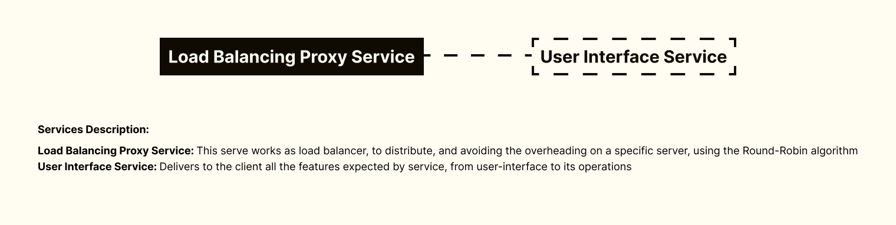

<h1 align="center">
Calculator With Next Js, Nginx Load Balancer Proxy Server, Server Side Rendering, Typescript, Sass
</h1>

 

 

  <a href="#description">✍️ Description</a> &nbsp;&nbsp;&nbsp;|&nbsp;&nbsp;&nbsp <a href="#topology">🗺️  Topology</a> &nbsp;&nbsp;&nbsp;|&nbsp;&nbsp;&nbsp <a href="#install">🔍 Install</a> &nbsp;&nbsp;&nbsp;|&nbsp;&nbsp;&nbsp <a href="#technologies">🚀 Technologies</a> &nbsp;&nbsp;&nbsp;|&nbsp;&nbsp;&nbsp <a href="#related">♟️ Related</a> &nbsp;&nbsp;&nbsp;|&nbsp;&nbsp;&nbsp <a href="#contact">✉️ Contact</a>

 
 

<h3 id="description">✍️ Description:</h3>

This project has a interesting web application using microservices of user interface (that delivers the calculator interface), and the load balancing proxy server, that create an end-point to the service url and balance the load of the server by following the Barbara Liskov and Miguel Castro Byzantine Faults Tolerance Algorithm that delivers a high available and trustable service in many cases, in special the DOS Attach (Deny Of Service). Beside that, this project is build using microservices architecture and hexagonal architecture on the client service. My will on this project was to create a really fancy situation simulating a real and well protected online application.

 

<h3 id="topology">🗺️  Topology:</h3>

 

<h3 id="install">🔍  Install:</h3>

To start the service, run the following commands:

**To run the service:**

`./service_starting.sh`

 

<h3 id="technologies">🚀  Technologies:</h3>

To build this project is used:

- React Js
- Next Js
- Typescript
- Custom Hooks
- Eslint
- Prettier
- EditorConfig
- Jest Js
- React Testing Library
- Docker
- Docker Compose
- Sass Css
- Redux (With Redux-Tool-Kit)
- Nginx

 

<h3 id="related">♟️  Related:</h3>

See more:

<ul>
  <li><a href="https://github.com/samueldecarvalhodeveloper/Calculator-App-With-Jetpack-Compose-Kotlin-Material-3-JUnit-Mockk-Dagger-2-Coroutines-Ui-Automator">Calculator App With Jetpack Compose</a></li>
  <li><a href="https://github.com/samueldecarvalhodeveloper/Calculator-App-With-React-Native-Expo-Custom-Hooks-Typescript-Async-Storage-Prettier-Eslint">Calculator App With React Native</a></li>
  <li><a href="https://github.com/samueldecarvalhodeveloper/Pokedex-API-With-Elixir-PHP-Python-Laravel-Phoenix-FastAPI-Uvicorn-Asyncio-Unittest-PHP-Unit-Docker">Pokedex Api With Laravel</a></li>
</ul>

 

<h3 id="contact">✉️  Contact:</h3>

**Email:**
<a href="mailto:personal.samuelcarvalho@gmail.com">personal.samuelcarvalho@gmail.com</a>

 
 

<strong>Repository Link:</strong>

[https://github.com/samueldecarvalhodeveloper/Calculator-With-Next-Js-Nginx-Load-Balancer-Proxy-Server-Server-Side-Rendering-Typescript-Sass](https://github.com/samueldecarvalhodeveloper/Calculator-With-Next-Js-Nginx-Load-Balancer-Proxy-Server-Server-Side-Rendering-Typescript-Sass)

